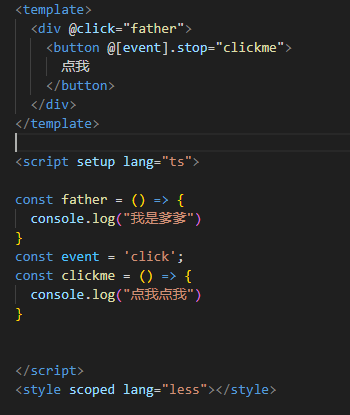
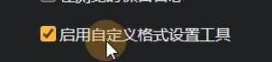

# up主小满zs
## 第一章 环境搭建
1. node.js 安装后自动会有npm
2. nvm 管理node版本的
3. 初始化脚手架
   1. npm init vite@latest
   2. 打开项目 npm install 安装依赖 -> 之后就生成node_modules
   3. npm run dev - >就运行了
## 第三章 
### vite目录
├── node_modules  
├── public  (静态资源,不会被vite编译)  
│   └── vite.svg  
├── src  
│   ├── assets (放静态资源)  
│   ├── components  (放组件)  
│   ├── App.vue  (全局vue入口文件)  
│   ├── main.ts  (全局ts文件,全局样式,api配置  
│   ├── style.css  (小垃圾没用)  
│   └── vite-env.d.ts  (让ts认识vue后缀的文件,嘿嘿)  
├── README.md  
├── haha.md  
├── index.html  (vite的入口文件,webpage是用js作为入口)  
├── package-lock.json  
├── package.json    (命令,依赖)  
├── tree.txt  
├── tsconfig.json   (ts配置文件  
├── tsconfig.node.json  
└── vite.config.ts  (vite配置文件)  
### 单文件组件SFC介绍
三个东西
### vue插件
1. volar
### npm run dev 过程
1. 从本地modules找vite
## 第四章
### 书写风格
```
<script setup >
const a :number[] [1,2,3,4]
</script>
```
### 动态点击事件,和阻止事件冒泡

### 使用ref和v-model

### 使用style

### 使用v-for

### 只渲染一次 v-once
## 第五章 diff算法 ,为啥要用key
## 第六章 ref
### 使用ref

### 判断ref
isRef()
### 浅层次判断ref
shallowRef() => 只有到第一层value才可以响应.

**注意ref如果放进去修改会影响浅层的ref**,因为底层调用了这个trigger();
### devtool谷歌启用自定义格式设置工具
 
可以方便的显示console的打印情况
## 第七章
### ref和reactive区别
1. ref支持所有类型,reactive只接受object
2. reactive取值复制不需要加.value
3. reactive 不能直接赋值,不然破坏响应式对象,解决办法(push,或者设置为对象,把数组最为属性去解决)
### 解构赋值

配合的是展开语法
## 第八章
### toref和torefs,toraw,man['__v_raw']
### 进阶,跳过
## 第九章
### computed 计算属性
#### 选项式写法

get是别人动的时候他被动的动  
set是自己把监听的属性变动了会被调用
#### 函数式写法

这种时候,无法设置新值(只能读),因为没用set
##第十章 watch监听器
监听,和深度监听(ref的对象,如果没用deep:true,那么无法监听到对象内部变化(有问题新旧值是一样的))

reactive开不开deep都能监听到

如果要监听其中的一个属性,那么得用回调getter函数变成引用类型
```html
immediate: true  //立即执行一次
flush:"pre"  //pre 组件更新前调用,sync 同步执行, post更新后调用
```
## 第十一章watcheffect 没做笔记
## 十二章 生命周期
update这个是基于dom来说的
onRenderTracked和onRenderTriggered两个调试的时候用
